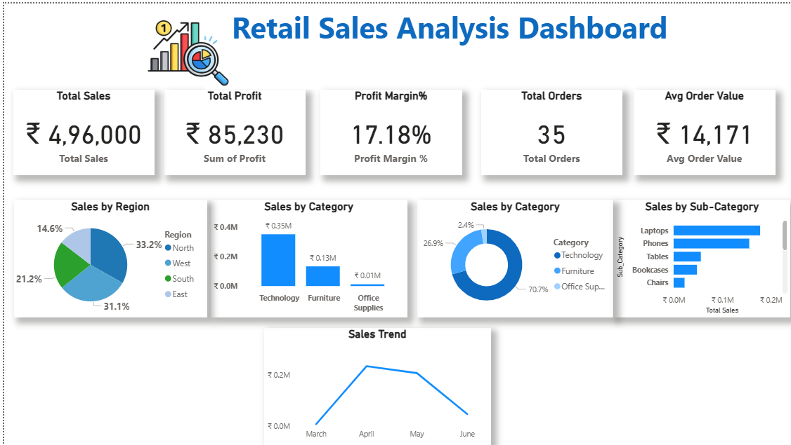

# 📊 Retail Sales Analysis Dashboard | Power BI

## 🔹 Project Overview
This project presents an end-to-end **Retail Sales Analysis Dashboard** built using **Power BI**.  
The objective of this project is to analyze sales performance, profitability, and trends across regions, categories, and sub-categories.

---

## 🔹 Tools & Technologies
- Power BI  
- DAX  
- Microsoft Excel  

---

## 🔹 Key KPIs
- Total Sales  
- Total Profit  
- Profit Margin %  
- Total Orders  
- Average Order Value  

---

## 🔹 Dashboard Features
- Sales analysis by **Region, Category, and Sub-Category**
- Monthly **Sales Trend Analysis**
- Interactive visuals with clean and professional design
- DAX measures for business metrics and aggregations

---

## 🔹 Key Insights
- Technology is the **top-performing category**
- **April recorded the highest monthly sales**
- A small number of sub-categories contribute to the **majority of revenue**

---

## 🔹 Files in this Repository
- `Retail_Sales_Analysis.pbix` → Power BI dashboard file  
- `Retail_Sales_Data.xlsx` → Dataset used for analysis  
- `dashboard.png` → Dashboard preview image  

---

## 🔹 Dashboard Preview

---

## 🔹 Au
